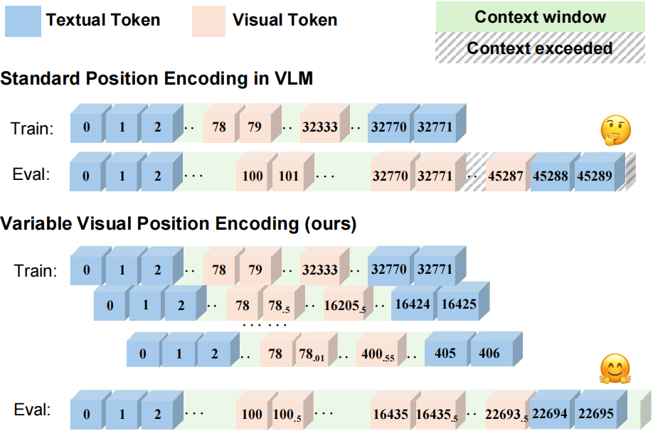
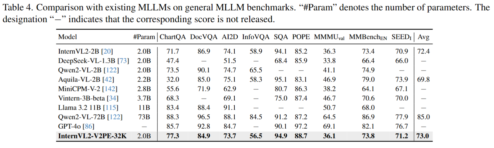
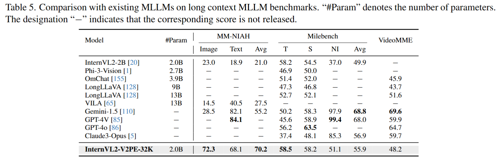

# V2PE: Improving Multimodal Long-Context Capability of Vision-Language Models with Variable Visual Position Encoding

The official implementation of the paper "[V2PE: Improving Multimodal Long-Context Capability of Vision-Language Models with Variable Visual Position Encoding](https://arxiv.org/abs/2412.09616)". 

<div align="center">
    
</div>

<div align="center">

[\[🆕 Blog\]](https://zzdhybthu.github.io/V2PE.github.io)  [\[📜 ArXiv Paper\]](https://arxiv.org/abs/2412.09616)  [\[🤗 HF Models\]](https://huggingface.co/OpenGVLab/V2PE)  [\[📖 HF Datasets\]](https://huggingface.co/datasets/OpenGVLab/V2PE-Data)

</div>


## 📖 Summary

The main contributions of this work are as follows:

- We construct mixed datasets for VLMs' long-context training and evaluation by augmenting existing multimodal instruction tuning datasets and conduct a thorough investigation into why current VLMs struggle with long-context multimodal inputs, revealing that directly applying LLM positional encoding to visual tokens is ineffective. 
- We propose Variable Visual Position Encoding (V2PE), a novel positional encoding strategy that employs variable and smaller increments for visual tokens, significantly enhancing VLMs' ability to understand and reason over long multimodal contexts.
- We apply our V2PE method and extend training data on the open-source VLM, InternVL2-2B. The fine-tuned VLM performs exceptionally well on both general multimodal benchmarks and long-context multimodal tasks, with the capacity to handle sequences of up to 1M tokens.

## 🛠️ Installation

See [INSTALLATION.md](INSTALLATION.md)

In addition, using this codebase requires executing the following steps:

- Install other requirements:

  ```bash
  pip install --upgrade pip  # enable PEP 660 support
  pip install -e .
  ```

## 📦 Model Preparation

Our models are built from InternVL2-2B.
Please download the above model weights and place them in the `pretrained/` folder.


| model name              | type | download                                                               |  size  |
| ----------------------- |------| ---------------------------------------------------------------------- |:------:|
| InternVL2-2B    | VLM  | 🤗 [HF link](https://huggingface.co/OpenGVLab/InternVL2-2B) | 4.4 GB |


```sh
cd pretrained/
# pip install -U huggingface_hub
huggingface-cli download --resume-download --local-dir-use-symlinks False OpenGVLab/InternVL2-2B --local-dir InternVL2-2B
```

The directory structure is:

```sh
pretrained
└── InternVL2-2B/
```

## 🔥 Supervised Fine-tuning

### Prepare Training Datasets

1. Download training and validation dataset from [HuggingFace](https://huggingface.co/datasets/OpenGVLab/V2PE-Data)

2. Organize the data as follows in `dataset/`:

    ```none
    dataset
    ├── annotation
    │   ├── long_mr_128k/
    │   ├── long_mr_256k/
    │   ├── long_mr_32k/
    │   ├── long_vqa_32k/
    │   ├── milebench_16k/
    │   └── milebench_nh/
    ├── image
    │   ├── long_mr
    │   │   ├── train/
    │   │   └── val/
    │   ├── long_vqa
    │   │   ├── image
    │   │   │   ├── deepform
    │   │   │   │   ├── train/
    │   │   │   │   └── val/
    │   │   │   ├── docvqa
    │   │   │   │   ├── train/
    │   │   │   │   └── val/
    │   │   │   ├── infovqa
    │   │   │   │   ├── train/
    │   │   │   │   └── val/
    │   │   │   ├── kleistercharity
    │   │   │   │   ├── train/
    │   │   │   │   └── val/
    │   │   │   ├── svqa
    │   │   │   │   ├── train/
    │   │   │   │   └── val/
    │   │   │   └── visualmrc
    │   │   │       ├── train/
    │   │   │       └── val/
    │   │   └── paste
    │   │       ├── chartqa
    │   │       │   ├── train/
    │   │       │   └── val/
    │   │       ├── clevr
    │   │       │   ├── train/
    │   │       │   └── val/
    │   │       ├── dvqa
    │   │       │   ├── train/
    │   │       │   └── val/
    │   │       ├── gqa
    │   │       │   ├── train/
    │   │       │   └── val/
    │   │       ├── ocrvqa
    │   │       │   ├── train/
    │   │       │   └── val/
    │   │       ├── okvqa
    │   │       │   ├── train/
    │   │       │   └── val/
    │   │       ├── tabfact
    │   │       │   ├── train/
    │   │       │   └── val/
    │   │       ├── textcaps
    │   │       │   ├── train/
    │   │       │   └── val/
    │   │       ├── textvqa
    │   │       │   ├── train/
    │   │       │   └── val/
    │   │       ├── vizwiz
    │   │       │   ├── train/
    │   │       │   └── val/
    │   │       └── wikitablequestions
    │   │           ├── train/
    │   │           └── val/
    │   └── milebench
    │       ├── clevr
    │       │   └── train/
    │       ├── gpr
    │       │   └── train/
    │       ├── iedit
    │       │   └── train/
    │       ├── mmcoqa
    │       │   └── train/
    │       ├── mmqa
    │       │   └── train/
    │       ├── nh
    │       │   └── train/
    │       ├── objintercn
    │       │   └── train/
    │       ├── ocrvqa
    │       │   └── train/
    │       ├── percept
    │       │   └── train/
    │       ├── slidevqa
    │       │   └── train/
    │       ├── spotdiff
    │       │   └── train/
    │       ├── sta_charades
    │       │   └── train/
    │       ├── star
    │       │   └── train/
    │       ├── tqa
    │       │   └── train/
    │       └── webqa
    │           └── train/
    └── val
        ├── long_mr_128k/
        ├── long_mr_1m/
        ├── long_mr_256k/
        ├── long_mr_512k/
        ├── long_vqa_32k/
        ├── long_vqa_40k/
        ├── long_vqa_48k/
        ├── long_vqa_56k/
        └── long_vqa_64k/
    ```

### Start Training

We provide slurm scripts for multi-node multi-GPU training. You can use 32 GPUs to train this model, and it will take approximately 48 hours.

```sh
# using 32 GPUs
PARTITION='your partition' GPUS=32 sh shell/internlm2_2b/internvl_chat_v2_internlm2_2b_dynamic_res_v2pe_32k.sh
```
### Training using ring-attention

When training on 256k length or longer dataset, you may need using [ring attention](https://github.com/zhuzilin/ring-flash-attention.git) to limit GPU memory usage. To use ring attention, you need to set two variables in the training script:
```bash
  --chunk_num 8 \
  --attn_type 'ring' \
```
Here, chunk_num specifies the number of chunks each sample is split into, which are distributed across chunk_num GPUs. The use_chunkTrainer flag indicates that ring attention is used during training.

We provide an example training script that utilizes ring attention at:
shell/internlm2_2b/internvl_chat_v2_internlm2_2b_dynamic_res_v2pe_256k.sh.
You can run this script with the following command:
```bash
# using 32 GPUs
PARTITION='your partition' GPUS=32 sh shell/internlm2_2b/internvl_chat_v2_internlm2_2b_dynamic_res_v2pe_256k.sh
```
## 📊 Evaluation
### Evaluation results in paper
**General MLLM Benchmarks**



**Long-Context MLLM Benchmarks**



### Evaluation results of our [released model](https://huggingface.co/OpenGVLab/V2PE)

After organizing our codebase and training a released model, we renewed our evaluation results of the released model as follows:

**General MLLM Benchmarks**

| Model                     | #Param | ChartQA | DocVQA | AI2D  | InfoVQA | SQA   | POPE  | MMMU<sub>val</sub> | MMBench<sub>EN</sub> | SEED<sub>I</sub> | Avg   |
|---------------------------|--------|---------|--------|-------|---------|-------|-------|--------------------|---------------------|------------------|-------|
| InternVL2-2B  | 2.0B   | 71.7    | 86.9   | 74.1  | 58.9    | 94.1  | 85.2  | 36.3               | 73.4                | 70.9             | 72.4  |
| DeepSeek-VL-1.3B | 2.0B   | 47.4    | -      | 51.5  | -       | 68.4  | 85.9  | 33.8               | 66.4                | 66.0             | -     |
| Qwen2-VL-2B  | 2.0B   | 73.5    | 90.1   | 74.7  | 65.5    | -     | -     | 41.1               | 74.9                | -                | -     |
| Aquila-VL-2B  | 2.2B   | 32.0    | 85.0   | 75.1  | 58.3    | 95.1  | 83.1  | 46.9               | 79.0                | 73.9             | 69.8  |
| MiniCPM-V-2  | 2.8B   | 55.6    | 71.9   | 62.9  | -       | 80.7  | 86.3  | 38.2               | 64.1                | 67.1             | -     |
| Vintern-3B-beta  | 3.7B   | 68.3    | -      | 69.1  | -       | 75.0  | 87.4  | 46.7               | 70.6                | 70.0             | -     |
| Llama 3.2 11B   | 11B    | 83.4    | 88.4   | 91.1  | -       | -     | -     | 50.7               | 68.0                | -                | -     |
| Qwen2-VL-72B  | 73B    | 88.3    | 96.5   | 88.1  | 84.5    | 91.2  | 87.2  | 64.5               | 86.9                | 77.9             | 85.0  |
| GPT-4o | -      | 85.7    | 92.8   | 84.7  | -       | 90.1  | 97.2  | 69.1               | 82.1                | 76.7             | -     |
| **InternVL2-V2PE-32K**    | 2.0B   | **76.4** | **83.9** | **73.2** | **55.9**  | **94.9** | **88.8**  | **36.6**             | **73.5**            | **71.2**          | **72.5** |

**Long-Context MLLM Benchmarks**

| Model                     | #Param | MM-NIAH/Image | MM-NIAH/Text | MM-NIAH/Avg | Milebench/T  | Milebench/S  | Milebench/NI | Milebench/Avg | VideoMME   | MVBench   |
|--------------------------|--------|---------------|--------------|-------------|--------------|--------------|---------------|--------------|------------|------------|
| InternVL2-2B            | 2.0B   | 23.0          | 18.9         | 21.0        | 58.2         | 54.5         | 37.0          | 49.9         | -      | -      |
| Phi-3-Vision            | 2.7B   | -         | -        | -       | 46.9         | 50.0         | -         | -         | -      | -      |
| OmChat                  | 3.9B   | -         | -        | -       | 51.4         | 52.0         | -         | -         | 45.9       | 50.2       |
| LongLLaVA               | 9B     | -         | -        | -       | 47.3         | 46.8         | -         | -         | 43.7       | 49.1       |
| LongLLaVA               | 13B    | -         | -        | -       | 52.7         | 52.1         | -         | -         | 51.6       | 54.6       |
| VILA                    | 13B    | 14.5          | 40.5         | 27.5        | -        | -        | -         | -         | -      | -      |
| Gemini-1.5              | -  | 28.5          | 82.1         | 55.2        | 50.2         | 58.3         | 97.9          | **68.8**     | **69.6**   | -      |
| GPT-4V                  | -  | -         | 84.1     | -       | 45.6         | 58.9         | **99.4**      | 68.0         | 59.9       | 43.5       |
| GPT-4o                  | -  | -         | -        | -       | 56.2         | **63.5**     | -         | -         | 64.7       | -      |
| Claude3-Opus            | -  | -         | -        | -       | 37.4         | 48.1         | 85.3          | 56.9         | 59.7       | -      |
| **InternVL2-V2PE-32K**  | 2.0B   | **78.1**      | **85.7**      | **81.8**    | **65.5**     | 56.4        | 97.2    | 72.5      | 50.7      | **65.6** |

## ❓ How to Evaluate

### Preparing General MLLM Benchmarks


#### [ChartQA test-human & test-augmented](https://aclanthology.org/2022.findings-acl.177/)

<details>
<summary>Data Preparation</summary>

```bash
mkdir -p data/chartqa && cd data/chartqa

# download images from https://drive.google.com/file/d/1Lm_w6zeET1Hyl_9ks6w5nEsgpoyPHalV/view

# download converted files
wget https://ofasys-wlcb.oss-cn-wulanchabu.aliyuncs.com/Qwen-VL/evaluation/chartqa/train_human.jsonl
wget https://ofasys-wlcb.oss-cn-wulanchabu.aliyuncs.com/Qwen-VL/evaluation/chartqa/train_augmented.jsonl
wget https://ofasys-wlcb.oss-cn-wulanchabu.aliyuncs.com/Qwen-VL/evaluation/chartqa/test_human.jsonl
wget https://ofasys-wlcb.oss-cn-wulanchabu.aliyuncs.com/Qwen-VL/evaluation/chartqa/test_augmented.jsonl

cd ../..
```

</details>

#### [DocVQA val & test](https://www.docvqa.org/datasets)

<details>
<summary>Data Preparation</summary>

```bash
mkdir -p data/docvqa && cd data/docvqa

# download images and annotations
wget https://datasets.cvc.uab.es/rrc/DocVQA/train.tar.gz --no-check-certificate # (optional)
wget https://datasets.cvc.uab.es/rrc/DocVQA/val.tar.gz --no-check-certificate
wget https://datasets.cvc.uab.es/rrc/DocVQA/test.tar.gz --no-check-certificate

# unzip files
tar -zxvf train.tar.gz
tar -zxvf val.tar.gz
tar -zxvf test.tar.gz

# download converted jsonl files
wget https://ofasys-wlcb.oss-cn-wulanchabu.aliyuncs.com/Qwen-VL/evaluation/docvqa/train.jsonl
wget https://ofasys-wlcb.oss-cn-wulanchabu.aliyuncs.com/Qwen-VL/evaluation/docvqa/val.jsonl
wget https://ofasys-wlcb.oss-cn-wulanchabu.aliyuncs.com/Qwen-VL/evaluation/docvqa/test.jsonl
cd ../..
```

</details>

#### [AI2D test](https://allenai.org/data/diagrams)

<details>
<summary>Data Preparation</summary>

```bash
mkdir -p data/ai2diagram && cd data/ai2diagram
# download converted files
wget https://huggingface.co/OpenGVLab/InternVL/raw/main/ai2d_test_vlmevalkit.jsonl -O test_vlmevalkit.jsonl
wget https://huggingface.co/OpenGVLab/InternVL/resolve/main/AI2D_TEST.zip && unzip AI2D_TEST.zip

# download images from Google drive (optional, provided by InternLM-XComposer)
# https://drive.google.com/file/d/1dqqa3MnrxMXaU_K9JA6C83je32ibwdOY/view?usp=sharing
# images should be placed in `data/ai2diagram/ai2d/abc_images` and `data/ai2diagram/ai2d/images`
cd ../..
```

</details>

#### [InfoVQA](https://rrc.cvc.uab.es/?ch=17)

<details>
<summary>Data Preparation</summary>

Please refer to https://rrc.cvc.uab.es/?ch=17 for details

</details>

#### [ScienceQA test](https://github.com/lupantech/ScienceQA)

<details>
<summary>Data Preparation</summary>

```bash
mkdir -p data/scienceqa/images && cd data/scienceqa/images

# download images
wget https://scienceqa.s3.us-west-1.amazonaws.com/images/test.zip && unzip test.zip

cd ..

# download original questions
wget https://github.com/lupantech/ScienceQA/blob/main/data/scienceqa/problems.json

# download converted files
wget https://ofasys-wlcb.oss-cn-wulanchabu.aliyuncs.com/Qwen-VL/evaluation/scienceqa/scienceqa_test_img.jsonl

cd ../..
```

</details>

#### [POPE](https://github.com/AoiDragon/POPE/tree/main)

<details>
<summary>Data Preparation</summary>

```bash
mkdir -p data/pope && cd data/pope

# make sure you have downloaded COCO images
ln -s ../coco/val2014 ./
wget https://github.com/OpenGVLab/InternVL/releases/download/data/llava_pope_test.jsonl

# download `coco` from POPE
mkdir -p coco && cd coco
wget https://github.com/AoiDragon/POPE/raw/e3e39262c85a6a83f26cf5094022a782cb0df58d/output/coco/coco_pope_adversarial.json
wget https://github.com/AoiDragon/POPE/raw/e3e39262c85a6a83f26cf5094022a782cb0df58d/output/coco/coco_pope_popular.json
wget https://github.com/AoiDragon/POPE/raw/e3e39262c85a6a83f26cf5094022a782cb0df58d/output/coco/coco_pope_random.json
cd ../../..
```

</details>

#### [MMMU](MMMU_validation_240124181104.json)

<details>
<summary>Data Preparation</summary>

The evaluation code will automatically download the dataset from huggingface.

</details>

#### [MMBench dev & test](https://github.com/open-compass/mmbench)

<details>
<summary>Data Preparation</summary>

```bash
mkdir -p data/mmbench && cd data/mmbench

# download csv files of mmbench
wget http://opencompass.openxlab.space/utils/MMBench/CCBench_legacy.tsv
wget https://download.openmmlab.com/mmclassification/datasets/mmbench/mmbench_dev_20230712.tsv
wget https://download.openmmlab.com/mmclassification/datasets/mmbench/mmbench_dev_cn_20231003.tsv
wget https://download.openmmlab.com/mmclassification/datasets/mmbench/mmbench_dev_en_20231003.tsv
wget https://download.openmmlab.com/mmclassification/datasets/mmbench/mmbench_test_cn_20231003.tsv
wget https://download.openmmlab.com/mmclassification/datasets/mmbench/mmbench_test_en_20231003.tsv

cd ../..
```

</details>

#### [SEED](https://github.com/AILab-CVC/SEED-Bench/)

<details>
<summary>Data Preparation</summary>

```bash
mkdir -p data/SEED && cd data/SEED
# 1. Follow the official instructions [Data Preparation for SEED-Bench-1](https://github.com/AILab-CVC/SEED-Bench/blob/main/DATASET.md#data-preparation-for-seed-bench-1)
#    to download the images and the videos. Put images under `./data/SEED/SEED-Bench-image`.
# 2. Extract the video frame in the middle from the downloaded videos, and put them under `./data/SEED/SEED-Bench-image`.
#    LLaVA provided the script [`extract_video_frames.py`](../internvl_chat/tools/extract_video_frames.py) modified from the official one.

wget https://huggingface.co/OpenGVLab/InternVL/raw/main/seed.jsonl
cd ../..
```

</details>

### Preparing Long-Context MLLM Benchmarks

#### [MM-NIAH](https://huggingface.co/datasets/OpenGVLab/MM-NIAH/tree/main)

<details>
<summary>Data Preparation</summary>

1. Download MM-NIAH dataset from [HuggingFace](https://huggingface.co/datasets/OpenGVLab/MM-NIAH/tree/main) and put the files in `dataset/benchmark/MM-NIAH` folder.

2. Unzip images using the following command

    ```bash
    tar -xzvf dataset/benchmark/MM-NIAH/mm_niah_test/images.tar.gz -C dataset/benchmark/MM-NIAH/mm_niah_test/
    tar -xzvf dataset/benchmark/MM-NIAH/mm_niah_val/annotations.tar.gz -C dataset/benchmark/MM-NIAH/mm_niah_val/
    ```
3. The directory structure should look like this:

    ```none
    dataset
    └── benchmark
        └── MM-NIAH
            ├── mm_niah_test
            │   ├── annotations/
            │   └── images/
            └── mm_niah_val/
                ├── annotations/
                └── images/
    ```

</details>

#### [Milebench](https://huggingface.co/datasets/FreedomIntelligence/MileBench/tree/main)

<details>
<summary>Data Preparation</summary>

1. Download milebench dataset from [hugging face](https://huggingface.co/datasets/FreedomIntelligence/MileBench/tree/main)

2. Unzip them using the following command
    
    ```bash
    for file in MileBench_part*.tar.gz
    do
    tar -xzvf "$file"
    done
    ```

3. Put the unzipped files in `dataset/benchmark/MileBench` folder. The directory structure should look like this:

    ```none
    dataset
    └── benchmark
        └── MileBench
            ├── ActionLocalization
            │   ├── images/
            │   └── ActionLocalization.json
            ├── ActionPrediction
            │   ├── images/
            │   └── ActionPrediction.json 
            |── ActionSequence
            │   ...
    ```

</details>

### Evaluation Steps

#### Evaluating General MLLM Benchmarks

<details>
<summary>Evaluation</summary>

For all general MLLM benchmarks, you can only run this one scripts to get all results.

```bash
# use STRIDE=64 as an example
STRIDE=64 sh scripts/evaluate_auto.sh <checkpoint> --rope_pos_id_version v2pe_fix --rope_pos_id_stride 64
```

</details>

#### Evaluating Long-Context MLLM Benchmarks

<details>
<summary>Evaluation for milebench</summary>

```bash
# use STRIDE=64 as an example
STRIDE=64 sh scripts/evaluate_milebench.sh <checkpoint> --rope_pos_id_version v2pe_fix --rope_pos_id_stride 64
```

</details>


<details>
<summary>Evaluation for mm_niah</summary>

```bash
# use STRIDE=64 as an example
STRIDE=64 sh scripts/evaluate_mmniah.sh <checkpoint> --rope_pos_id_version v2pe_fix --rope_pos_id_stride 64
```

</details>
<details>
<summary>Evaluation for mm_niah-1M</summary>

```bash
# use STRIDE=64 as an example
STRIDE=64 sh scripts/evaluate_mmniah_long.sh <checkpoint> --rope_pos_id_version v2pe_fix --rope_pos_id_stride 64
```

</details>

<details>
<summary>Evaluation for long-vqa</summary>

```bash
# use STRIDE=64 as an example
STRIDE=64 GROUP=32 GPUS_PER_TASK=1 sh scripts/evaluate_longvqa.sh <checkpoint> --rope_pos_id_version v2pe_fix --rope_pos_id_stride 64
STRIDE=64 GROUP=40 GPUS_PER_TASK=2 sh scripts/evaluate_longvqa.sh <checkpoint> --rope_pos_id_version v2pe_fix --rope_pos_id_stride 64
STRIDE=64 GROUP=48 GPUS_PER_TASK=2 sh scripts/evaluate_longvqa.sh <checkpoint> --rope_pos_id_version v2pe_fix --rope_pos_id_stride 64
STRIDE=64 GROUP=56 GPUS_PER_TASK=4 sh scripts/evaluate_longvqa.sh <checkpoint> --rope_pos_id_version v2pe_fix --rope_pos_id_stride 64
STRIDE=64 GROUP=64 GPUS_PER_TASK=4 sh scripts/evaluate_longvqa.sh <checkpoint> --rope_pos_id_version v2pe_fix --rope_pos_id_stride 64
```

</details>

## 🎫 License

This project is released under the [MIT License](LICENSE).

## 🖊️ Citation

If you find this work helpful in your research, please consider citing:

```bibtex
@misc{ge2024v2peimprovingmultimodallongcontext,
      title={V2PE: Improving Multimodal Long-Context Capability of Vision-Language Models with Variable Visual Position Encoding}, 
      author={Junqi Ge and Ziyi Chen and Jintao Lin and Jinguo Zhu and Xihui Liu and Jifeng Dai and Xizhou Zhu},
      year={2024},
      eprint={2412.09616},
      archivePrefix={arXiv},
      primaryClass={cs.CV},
      url={https://arxiv.org/abs/2412.09616}, 
}
```
